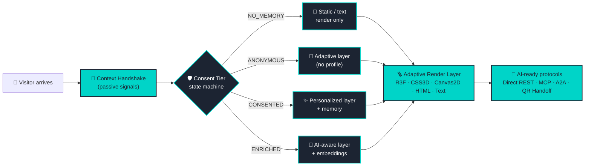
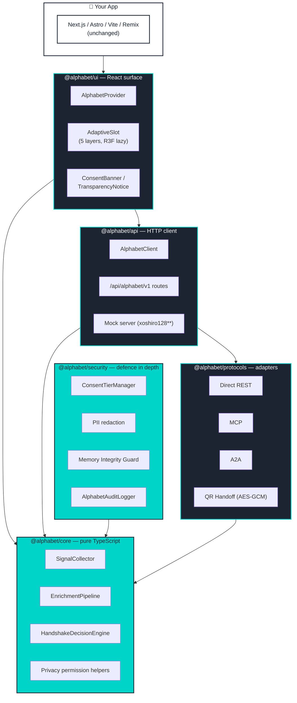

<div align="center">


# Alphabet

### **The Alphabet of Your Web**

<p><sub><em>الفبای وب تو</em></sub></p>

**Alphabet 1.0 (danial.ai Edition)** &nbsp;·&nbsp;
A privacy-first, context-aware, adaptive web SDK
— part of the [**Alefba International AI Research &amp; Development Program**](https://alef.ba)

[**🌐 alef.ba**](https://alef.ba) &nbsp;·&nbsp;
[**🔡 alphabet.alef.ba**](https://alphabet.alef.ba) &nbsp;·&nbsp;
[**📚 Documentation**](docs/) &nbsp;·&nbsp;
[**🧪 Examples**](examples/) &nbsp;·&nbsp;
[**🗺️ Roadmap**](docs/ROADMAP.md)

<p>
  <a href="LICENSE"></a>
  
  
  
  
  
</p>

<p>
  
  
  
  
</p>

</div>

---

## ✨ Try the Live Demo on danial.ai

> **The flagship public face of Alphabet** lives on **[danial.ai/alphabet](https://danial.ai/alphabet)** — a production-grade interactive showcase built by [Danial Samiei](https://danial.ai), founder of the Alefba program.

<p align="center">
  <a href="https://danial.ai/alphabet"></a>
  &nbsp;
  <a href="https://vercel.com/new/clone?repository-url=https%3A%2F%2Fgithub.com%2Fdanialsamiei%2Falphabet&project-name=alphabet-danial-demo&root-directory=apps%2Fdanial-demo&build-command=cd+..%2F..+%26%26+pnpm+install+--frozen-lockfile+%26%26+pnpm+--filter+%27%40alphabet%2Fdanial-demo...%27+build&output-directory=dist"></a>
</p>

The demo lives in [`apps/danial-demo`](apps/danial-demo/) and ships **six live interactive proofs** plus the floating **Invisible Ethical Alef Agent**:

1. **Render Layers** — seamless degradation R3F → CSS 3D → Canvas 2D → Static HTML → Text-only.
2. **Context Handshake** — real-time `collect → enrich → decide` stream with phase timings.
3. **Consent Ladder** — interactive 4-tier consent state machine with live event log.
4. **Trust Pulse Dashboard** — live 0–100 privacy score, signals used, memory tier.
5. **Living Memory Engine** — six on-device memory domains with consent-tier gating.
6. **AI Protocol Playground** — Alphabet Protocol v2 against the in-process mock server.

Embed it on your own site in one line:

```tsx
import { AlphabetDemo } from '@alphabet/danial-demo';
import '@alphabet/danial-demo/styles';

<AlphabetDemo defaultTab="layers" />;
```

See [`apps/danial-demo/README.md`](apps/danial-demo/README.md) for full embed, deployment, and customization docs.

**Canonical demo path for CI/CD and contributors:** [`apps/danial-demo`](apps/danial-demo/)

---

> **Alphabet** treats *language*, *direction*, *device*, *network*, and *consent*
> as the elementary letters of an experience — the **alphabet of the web** —
> that any page assembles itself from at runtime.
>
> Formerly known as **AWAF** (Alefba Web-Aware Framework), Alphabet now ships as
> the flagship public SDK of the Alefba program.

> [!IMPORTANT]
> **Heritage.** Alphabet was incubated as **AWAF** (Alefba Web-Aware Framework).
> The 1.0 release renames the project to **Alphabet** to better reflect its
> identity as the *alphabet of your web*. Package scopes have moved from
> `@awaf/*` to `@alphabet/*`. The behaviour, contracts, and privacy guarantees
> are unchanged. See [`docs/IMPLEMENTATION_STATUS.md`](docs/IMPLEMENTATION_STATUS.md)
> for a feature-by-feature audit and [`docs/ROADMAP.md`](docs/ROADMAP.md) for
> the path forward.

---

## Table of contents

- [What is Alphabet?](#what-is-alphabet)
- [The Alefba program](#the-alefba-program)
- [Why Alphabet exists](#why-alphabet-exists)
- [What Alphabet is *not*](#what-alphabet-is-not)
- [Core concepts](#core-concepts)
- [Architecture at a glance](#architecture-at-a-glance)
- [Quick start](#quick-start)
- [Implemented features](#implemented-features)
- [Roadmap](#roadmap)
- [Examples](#examples)
- [Privacy model](#privacy-model)
- [Integration targets](#integration-targets)
- [Why Alphabet?](#why-alphabet)
- [Documentation](#documentation)
- [Contributing](#contributing)
- [License &amp; credits](#license--credits)
- [خلاصه فارسی (Persian summary)](#خلاصه-فارسی-persian-summary)

---

## What is Alphabet?

**Alphabet is a privacy-first adaptive web SDK** for building context-aware,
multilingual, capability-adaptive, AI-ready web experiences without invasive
tracking.

It is **a key tool of the [Alefba International AI Research &amp; Development
Program](https://alef.ba)** — the public, developer-facing surface of a wider
research effort into context-aware, consent-respecting, privacy-preserving web
infrastructure.

In a single sentence:

> Alphabet reads the **passive signals every browser already sends** — language,
> direction, timezone, device class, network quality, GPU tier, DNT/GPC,
> `prefers-reduced-motion` — and uses them, **with explicit consent**, to choose
> the right locale, the right reading direction, the right rendering layer, and
> the right hero copy. No fingerprinting. No cookies. No PII in logs.

It is **not** a CMS, not a renderer, not a router, not a CMP, not a feature-flag
platform, and not an AI provider. It is a **small, edge-safe SDK that integrates
alongside** Next.js, Astro, Vite, i18next, the Vercel AI SDK, GrowthBook,
LaunchDarkly, OneTrust, and others.

---

## The Alefba program

<table>
<tr>
<td width="56" align="center" valign="top">

🔡

</td>
<td>

**Alefba** (الفبا) is Persian for *alphabet* — the elementary letters from which
any language is built. The **Alefba International AI Research &amp; Development
Program** at [**alef.ba**](https://alef.ba) explores how the same idea applies
to the web: *what are the elementary letters of a humane, context-aware
experience?*

**Alphabet** is the program's first public SDK. It is built and stewarded by
the **Alefba International Development Team** and led by **[Danial Samiei
(danial.ai)](https://danial.ai)**, the program's founder.

| | |
|---|---|
| 🌐 **Mother program** | [alef.ba](https://alef.ba) |
| 🔡 **Project page** | [alphabet.alef.ba](https://alphabet.alef.ba) |
| 👤 **Founder** | Danial Samiei — [danial.ai](https://danial.ai) |
| 🛠️ **Team** | Alefba International Development Team |
| 📜 **License** | MIT |

</td>
</tr>
</table>

---

## Why Alphabet exists

Most websites still serve every visitor the same glyphs, in the same direction,
at the same visual fidelity, regardless of who they are or what their browser
already knows about them. The two common ways out of this are bad:

1. **Static one-size-fits-all** — ships a 4 K hero video to a 2 G phone, ships
   English-LTR copy to a Persian-RTL reader, ships motion-heavy animations to
   someone who set `prefers-reduced-motion: reduce`.
2. **Surveillance personalization** — third-party cookies, fingerprinting, ad
   IDs, server-side IP→geo lookups, dark-pattern consent banners. Increasingly
   illegal, increasingly unwelcome, increasingly broken by browsers.

Alphabet offers a third path: **adapt to what the browser already volunteers,
respect every privacy signal as a hard constraint, and degrade rendering
gracefully across five layers**. The result is an experience that feels
personal *without* tracking the person.

---

## What Alphabet is *not*

| It is *not* | Why we say so |
|---|---|
| A CMS or page-builder | Alphabet does not own your routes, your data model, or your rendering. |
| A replacement for Next.js / Astro / Remix | Alphabet runs *alongside* these frameworks as a small SDK. |
| A replacement for i18next / next-intl / FormatJS | Alphabet *detects* language and direction; it hands them to your i18n library. |
| A complete privacy compliance solution | Alphabet is **aligned with** GDPR, CCPA, and LGPD principles, but compliance is the integrator's responsibility. |
| A bundled LLM provider | Alphabet stays provider-neutral. You bring your own AI SDK; Alphabet supplies a normalized context envelope. |
| A fingerprinting library | Alphabet refuses to fingerprint. There is no `getDeviceId()` and there never will be. |

---

## Core concepts

Alphabet rests on four ideas. The full treatment is in
[`docs/CORE_CONCEPTS.md`](docs/CORE_CONCEPTS.md).



### 1. Context Handshake

A pure, deterministic pipeline — `SignalCollector` → `EnrichmentPipeline` →
`HandshakeDecisionEngine` — that turns passive browser signals into a
`HandshakeDecision { selectedLayer, uiConfig, privacyMode, … }`. No IP lookups.
No third-party calls. Edge-safe.

### 2. Consent Ladder

A four-step state machine — `NO_MEMORY` → `ANONYMOUS` → `CONSENTED` →
`ENRICHED` — enforced by `ConsentTierManager` with monotonic upgrades, explicit
revoke, **DNT/GPC auto-downgrade**, and policy-version invalidation.

### 3. Adaptive Render Layers

Five layers of progressive enhancement — `R3F` (immersive WebGL) → `CSS3D` →
`CANVAS2D` → `STATIC_HTML` → `TEXT_ONLY`. Each one is a *fully functional UI*,
not a degraded version of a "real" one. R3F is lazy-loaded so the base bundle
stays R3F-free.

### 4. AI-ready protocols

A normalized `AlphabetProtocolRequest` / `AlphabetProtocolResponse` envelope
across **Direct REST**, **Model Context Protocol (MCP)**, **Agent-to-Agent
(A2A)**, and **AES-GCM-encrypted QR handoff**. Provider-neutral by design.

---

## Architecture at a glance



| Package | Status | Role |
|---|---|---|
| [`@alphabet/core`](packages/core)             | ✅ shipped | Types, config, logger, event hub, handshake primitives, privacy helpers. |
| [`@alphabet/security`](packages/security)     | ✅ shipped | Consent state machine, PII redaction, prompt-injection heuristics, audit log. |
| [`@alphabet/api`](packages/api)               | 🟡 partial | HTTP client, mock server, transport utilities. |
| [`@alphabet/ui`](packages/ui)                 | 🟡 partial | React provider, AdaptiveSlot (5 layers), ConsentBanner, hooks. |
| [`@alphabet/protocols`](packages/protocols)   | 🟡 partial | Direct REST · MCP · A2A · QR handoff adapters. |
| [`create-alphabet`](packages/create-alphabet) | 🟡 partial | `pnpm create alphabet` scaffolding. |

---

## Quick start

### Install and run the test suite

```bash
git clone https://github.com/danialsamiei/alphabet.git
cd alphabet

pnpm install
pnpm build
pnpm typecheck
pnpm test
```

### Use the handshake primitives — pure TypeScript

The fully-shipped, end-user-facing surface is `@alphabet/core`. A minimal,
honest example:

```typescript
import {
  SignalCollector,
  EnrichmentPipeline,
  HandshakeDecisionEngine,
} from '@alphabet/core';

// 1. Collect passive browser signals (no IP lookup, no third-party calls).
const signals = new SignalCollector().collect();

// 2. Enrich with a coarse geo context that *you* supply
//    (Alphabet does not do server-side IP→geo lookups itself).
const enriched = new EnrichmentPipeline().enrich(signals, {
  country: 'US', // ISO 3166-1 alpha-2
  timezone: signals.timezone,
});

// 3. Decide the UI configuration.
const decision = new HandshakeDecisionEngine().decide(enriched);

console.log(decision.uiConfig);
// { locale: 'en-US', direction: 'ltr', theme: 'auto', heroCopy: '…', … }
console.log(decision.privacyMode);
// { canStoreMemory: false, canPersonalize: false, canUseAnalytics: false, canUsePreciseGeo: false }
```

### Use the React surface

```tsx
import { AlphabetProvider, AdaptiveSlot, ConsentBanner } from '@alphabet/ui';

export function App() {
  return (
    <AlphabetProvider>
      <AdaptiveSlot
        r3f={({ direction, locale }) => <ImmersiveScene dir={direction} lang={locale} />}
        css3d={({ direction, locale }) => <Css3dHero dir={direction} lang={locale} />}
        canvas2d={({ direction, locale }) => <Canvas2dHero dir={direction} lang={locale} />}
        staticHtml={({ direction, locale }) => <StaticHero dir={direction} lang={locale} />}
        textOnly={({ direction, locale }) => <TextHero dir={direction} lang={locale} />}
      />
      <ConsentBanner />
    </AlphabetProvider>
  );
}
```

### Drop into Next.js (App Router)

```tsx
// app/layout.tsx
import { AlphabetProvider } from '@alphabet/ui';
import '@alphabet/ui/styles/tokens.css';

export default function RootLayout({ children }: { children: React.ReactNode }) {
  return (
    <html>
      <body>
        <AlphabetProvider>{children}</AlphabetProvider>
      </body>
    </html>
  );
}
```

### Drop into Astro Islands

```astro
---
// src/pages/index.astro
import AlphabetIsland from '../components/AlphabetIsland';
---
<html>
  <body>
    <AlphabetIsland client:load />
  </body>
</html>
```

### Drop into Vite + React

```tsx
// src/main.tsx
import React from 'react';
import { createRoot } from 'react-dom/client';
import { AlphabetProvider } from '@alphabet/ui';
import App from './App';

createRoot(document.getElementById('root')!).render(
  <AlphabetProvider>
    <App />
  </AlphabetProvider>,
);
```

More walk-throughs live in [`examples/`](examples/) and
[`docs/EXAMPLES.md`](docs/EXAMPLES.md).

---

## Implemented features

The following ships as real code, exported from a package, and covered by unit
tests in this repository. See
[`docs/IMPLEMENTATION_STATUS.md`](docs/IMPLEMENTATION_STATUS.md) for
file-level evidence.

### `@alphabet/core` ✅
- Strict-typed foundation: `Result<T, E>`, branded IDs (`VisitorId`,
  `SessionId`, `MemoryId`, `RequestId`, `ConsentToken`, `AuditLogId`,
  `ConfirmationId`), `ConsentTier`, `CapabilityLayer`, `MemoryDomain`,
  `ProtocolType`.
- `AlphabetConfig`, `AlphabetLogger` (PII-safe,
  `exactOptionalPropertyTypes`-clean), `AlphabetEventEmitter`.
- Three handshake primitives — `SignalCollector`, `EnrichmentPipeline`,
  `HandshakeDecisionEngine` (locale + hero-copy maps for 25+ locales) — plus
  the higher-level `HandshakeOrchestrator` that runs collect→enrich→decide as
  one Result-returning call.
- Privacy helpers: `canStoreMemory`, `canPersonalize`, `canUseAnalytics`,
  `canUsePreciseGeo` — the only authoritative permission checks in the SDK.

### `@alphabet/api` 🟡
- `AlphabetClient` with one method per documented endpoint, returning
  `Promise<Result<T, AlphabetError>>`. `fetch` + `AbortController` timeouts.
- `HandshakeClient` for `POST /api/alphabet/v1/context/handshake` (envelope
  in / envelope out).
- Canonical prefix `/api/alphabet/v1` (legacy `/api` accepted via
  `normalizeApiBaseUrl`). Full contract in
  [`openapi/alphabet.v1.yaml`](openapi/alphabet.v1.yaml).
- Mock server (`./mock`) with seeded xoshiro128\*\* RNG, plus transport
  utilities (`./transport`) — retry with decorrelated jitter, idempotency
  keys, rate-limit parsing.

### `@alphabet/security` ✅ (defence-in-depth supplement)
- `ConsentTierManager` — code-enforced state machine
  (`pending → granted → revoked`) with monotonic upgrades, **DNT/GPC
  auto-downgrade**, and policy-version invalidation. Persists via optional
  storage adapters (`InMemoryConsentStorage`, `WebStorageConsentStorage`).
- PII redaction (`redactPII`, `redactPIIDeep`, `detectPII`) at three
  strictness levels.
- Prompt-injection heuristics (`detectPromptRisk`).
- Output validation (`validateUrl`, `sanitizeHtml`, `markTextAsSafe`).
- `MemoryIntegrityGuard`, `AlphabetAuditLogger` with structured event
  categories and automatic PII redaction.
- **Scope.** This is a defence-in-depth supplement, *not* a complete security
  solution. See [`docs/SECURITY_MODEL.md`](docs/SECURITY_MODEL.md).

### `@alphabet/ui` 🟡
- `AlphabetProvider`, `AdaptiveSlot` (5-layer renderer with lazy R3F),
  `ConsentBanner`, `TransparencyNotice`, hooks (`useAlphabetContext`,
  `useConsent`, `useAlphabetHandshake`, `useAlphabetConsent`).
- Subpath exports: `./hooks`, `./layers`, `./layers/r3f`, `./runtime`.
- R3F + `three` are external in the base bundle; the immersive layer is
  loaded only when selected.

### `@alphabet/protocols` 🟡
- Normalized `AlphabetProtocolRequest` / `AlphabetProtocolResponse` contract.
- `direct-api`, `mcp`, `a2a`, `qr-handoff`, `normalizers`, `errors`,
  `ai-sdk` subpaths. **AES-GCM-encrypted** QR handoff with audience binding
  and a 60 s default expiry.
- Additive `./v2` surface: pluggable provider adapters
  (OpenAI / Anthropic / Grok / Gemini / Mistral / Fireworks), `AlphabetAiClient`
  with fallback chain, ECDSA P-256 consent proofs, and the
  `ProactiveLayerForecaster`.

### Repository tooling
- pnpm workspaces + Turborepo 2.x (`tasks` schema). `pnpm build`,
  `pnpm test`, `pnpm typecheck` all green.
- Per-package Vite library builds (ESM + CJS).
- Strict TypeScript everywhere — no `any` in source,
  `exactOptionalPropertyTypes: true`.
- Changesets, size-limit, OpenAPI 3.1 contract.

---

## Roadmap

A condensed view; the full plan is in [`docs/ROADMAP.md`](docs/ROADMAP.md).

| Phase | Focus | Key artifacts |
|---|---|---|
| ✅ **0 — Brand** *(this release)* | Rename AWAF → **Alphabet 1.0 (danial.ai Edition)**. Public framing under the Alefba program. | This README, package scope `@alphabet/*`, [`alphabet.alef.ba`](https://alphabet.alef.ba). |
| **1 — Truth alignment** | Honest README, Implementation Status, Roadmap, comparison &amp; integration narrative. | [`docs/IMPLEMENTATION_STATUS.md`](docs/IMPLEMENTATION_STATUS.md), [`docs/CORE_CONCEPTS.md`](docs/CORE_CONCEPTS.md), [`docs/INTEGRATIONS.md`](docs/INTEGRATIONS.md). |
| **2 — Smallest end-to-end** | `HandshakeOrchestrator`, real `display`/`consent`/`morph` phases, mock server, Layers 4 + 5 demo. | `apps/danial-demo` running; `pnpm dev` opens the canonical adaptive page. |
| **3 — Adapters** | `@alphabet/next`, `@alphabet/vite`, `@alphabet/astro` first-class wrappers. | Working examples in `examples/`. |
| **4 — Pulse plugin** | `@alphabet/pulse` (formerly Technology Pulse): trust-tiered ingestion, C2PA-style provenance, RAG brief generation. | Optional plugin module, opt-in. |
| **5 — Hardening** | Benchmarks (sub-100 ms handshake target), NIST AI RMF mapping doc, cost guardian, differential-privacy helpers, accessibility audit. | 1.x maturity. |

No fixed dates are committed. Phases are scoped, not timeboxed.

---

## Examples

Three runnable starters live in [`examples/`](examples/):

| Example | Stack | What it demonstrates |
|---|---|---|
| [`examples/vite-react-basic`](examples/vite-react-basic) | Vite + React | `AlphabetProvider`, `AdaptiveSlot`, `ConsentBanner`, `TransparencyNotice`. |
| [`examples/next-app-router-basic`](examples/next-app-router-basic) | Next.js App Router | SSR-safe handshake, server / client boundaries. |
| [`examples/astro-islands-basic`](examples/astro-islands-basic) | Astro Islands | Static-first rendering with a React island for Alphabet. |
| [`examples/vercel-ai-sdk-protocol-v2`](examples/vercel-ai-sdk-protocol-v2) | Vercel AI SDK + Alphabet protocol v2 | Provider-neutral context envelope around a chat route. |

Walk-throughs are in [`docs/EXAMPLES.md`](docs/EXAMPLES.md).

---

## Privacy model

The full model lives in [`docs/PRIVACY_MODEL.md`](docs/PRIVACY_MODEL.md). The
short version:

- **Tier 0 (`NO_MEMORY`) by default.** Until a visitor explicitly grants
  consent, Alphabet stores nothing, profiles nothing, and personalizes nothing.
- **DNT/GPC restrict storage and personalization, *not* rendering.** A visitor
  with GPC enabled and a capable device still sees an immersive UI; they just
  don't get tracked. Render layer is selected from device capability and
  accessibility preferences only.
- **Coarse geo by default.** `EnrichmentPipeline.enrich(signals)` returns
  `{ country, timezone, region }`. `city`, `coarseLatitude`, and
  `coarseLongitude` are gated behind `{ allowPreciseGeo: true }` *and*
  `canUsePreciseGeo()` returning `true`.
- **No fingerprinting. No cookies. No PII in logs.** Alphabet reads passive
  signals only and never hashes navigator properties into a fingerprint.
- **Code-enforced consent ladder.** `ConsentTierManager` is a state machine
  with monotonic upgrades, explicit revoke, DNT/GPC auto-downgrade, and
  policy-version invalidation.

Alphabet is **aligned with GDPR, CCPA, and LGPD principles** (lawful basis, data
minimization, right to erasure, opt-out signals). It is **not certified
compliant** with any of them — that is the integrator's responsibility, and
auditing is on the roadmap.

---

## Integration targets

Alphabet is designed to *integrate*, not replace. See
[`docs/INTEGRATIONS.md`](docs/INTEGRATIONS.md) for the full guide.

| Integration | What Alphabet contributes |
|---|---|
| **Next.js / Astro / Remix / Vite + React** | Runs alongside as a small SDK. Hands the handshake decision to your renderer; never owns routing or hydration. |
| **i18next, next-intl, FormatJS** | Detects `Accept-Language`, negotiates the primary locale + direction, hands the chosen `locale` and `dir` to your i18n library. |
| **Vercel AI SDK, LangChain, OpenAI/Anthropic SDK** | Provides a normalized `AlphabetProtocolRequest` envelope with consent and memory permissions. Alphabet stays provider-neutral; you keep your model client. |
| **GrowthBook, LaunchDarkly, Statsig** | Exposes privacy-safe context traits (`locale`, `capabilityLayer`, `consentTier`, `prefersReducedMotion`) for targeting and experimentation. |
| **OneTrust, Cookiebot, Klaro** | Interoperates with a full CMP via the consent state machine; Alphabet's `ConsentTierManager` can be the source-of-truth or a downstream consumer. |
| **Edge runtimes (Cloudflare Workers, Vercel Edge, Deno Deploy)** | The `@alphabet/core` handshake is pure-TypeScript, dependency-free, and edge-safe. |

---

## Why Alphabet?

> **Why a new name?** Because *AWAF* described an internal acronym; *Alphabet*
> describes an idea anyone can grasp in five seconds. The web has letters; we
> compose them.

| | |
|---|---|
| 🛡️ **Privacy-first** | Tier 0 default. DNT/GPC respected as a hard constraint. No fingerprinting, ever. |
| 🌍 **World-aware** | 25+ locale aliases, RTL/LTR-aware decisions, country + timezone enrichment, no IP lookups. |
| 🪜 **Capability-adaptive** | Five render layers from R3F immersive to text-only. Each one is *fully functional*, not a degraded fallback. |
| 🤖 **AI-ready** | Provider-neutral envelope across REST, MCP, A2A, QR handoff. Bring your own model client. |
| 🔌 **Integrates, doesn't replace** | Sits alongside Next.js, Astro, Vite, i18next, AI SDKs, CMPs, and feature flags. |
| 📦 **Small &amp; edge-safe** | `@alphabet/core` is dependency-free pure TypeScript. R3F is lazy-loaded only when selected. |
| 🧪 **Honest** | Every feature in this README is either ✅ shipped or 🟡 partial, audited in `docs/IMPLEMENTATION_STATUS.md`. |
| 🔡 **Part of Alefba** | Built within a wider AI research program at [alef.ba](https://alef.ba). |

---

## Documentation

| Document | Purpose |
|---|---|
| [`docs/LAUNCH_NARRATIVE.md`](docs/LAUNCH_NARRATIVE.md) | 5-minute introduction: problem, solution, why now, target devs, demo story. |
| [`docs/CORE_CONCEPTS.md`](docs/CORE_CONCEPTS.md) | Context Handshake, Consent Ladder, Adaptive Render Layers, AI-ready protocols. |
| [`docs/ADAPTIVE_RENDER_LAYERS.md`](docs/ADAPTIVE_RENDER_LAYERS.md) | The five layers, capability matrix, and accessibility rules. |
| [`docs/PRIVACY_MODEL.md`](docs/PRIVACY_MODEL.md) | Tier 0 default, DNT/GPC behaviour, coarse geo, code-enforced consent. |
| [`docs/API_CONTRACT.md`](docs/API_CONTRACT.md) | Request/response envelope, `Result<T, E>`, route table, versioning. |
| [`docs/INTEGRATIONS.md`](docs/INTEGRATIONS.md) | Integration patterns for Next.js, Astro, i18next, AI SDKs, feature-flag platforms. |
| [`docs/EXAMPLES.md`](docs/EXAMPLES.md) | Walk-through of the example projects in `examples/`. |
| [`docs/PROTOCOLS.md`](docs/PROTOCOLS.md) | Direct REST, MCP, A2A, QR handoff adapters. |
| [`docs/ARCHITECTURE.md`](docs/ARCHITECTURE.md) | Conceptual 8-layer architecture (vision-level). |
| [`docs/IMPLEMENTATION_STATUS.md`](docs/IMPLEMENTATION_STATUS.md) | Truth-of-record audit: what is implemented vs. planned. |
| [`docs/ROADMAP.md`](docs/ROADMAP.md) | Phased plan to maturity. |
| [`docs/SECURITY_MODEL.md`](docs/SECURITY_MODEL.md) | Scope and limitations of `@alphabet/security`. |
| [`docs/CONTRIBUTING.md`](docs/CONTRIBUTING.md) · [`docs/DEVELOPMENT.md`](docs/DEVELOPMENT.md) · [`docs/CODING_CONVENTIONS.md`](docs/CODING_CONVENTIONS.md) | Contributor onboarding. |
| [`AGENTS.md`](AGENTS.md) | AI-agent onboarding (vision-level). |

---

## Contributing

We welcome code, documentation, translation, and security contributions.

- **General contribution guide:** [`CONTRIBUTING.md`](CONTRIBUTING.md) and
  [`docs/CONTRIBUTING.md`](docs/CONTRIBUTING.md)
- **Coding conventions:** [`docs/CODING_CONVENTIONS.md`](docs/CODING_CONVENTIONS.md)
- **AI-agent onboarding:** [`AGENTS.md`](AGENTS.md)

A few rules specific to this stage of the project:

1. **No new overclaiming.** PRs may not introduce phrases like "complete
   defense", "fully implemented", "guarantees", or "compliant" for features
   that are not backed by shipped code, tests, and an entry in
   `docs/IMPLEMENTATION_STATUS.md`.
2. **No new runtime dependencies** unless absolutely necessary. Alphabet stays
   light. Build-time dev dependencies are fine.
3. **TypeScript strictness is non-negotiable.** No `any` in source; use
   `unknown` + narrowing or branded types.
4. **Prefer files under 300 lines** where practical.

---

## License &amp; credits

**MIT** — see [`LICENSE`](LICENSE).

<div align="center">


**Alphabet 1.0 (danial.ai Edition)**

Built as part of the **[Alefba International AI Research &amp; Development
Program](https://alef.ba)**
by **[Danial Samiei (danial.ai)](https://danial.ai)** &amp; the
**Alefba International Development Team**.

[alef.ba](https://alef.ba) &nbsp;·&nbsp; [alphabet.alef.ba](https://alphabet.alef.ba) &nbsp;·&nbsp; [danial.ai](https://danial.ai)

</div>

---

## خلاصه فارسی (Persian summary)

<div dir="rtl" align="right">

**Alphabet** (الفبا) یک SDK سبک به زبان TypeScript است: یک لایهٔ **بافتار تطبیقی
و حریم خصوصی** که در کنار Next.js، Astro، i18next، Vercel AI SDK، GrowthBook و
LaunchDarkly قرار می‌گیرد و **جایگزین** هیچ‌کدام نیست. Alphabet بخشی از
**برنامهٔ بین‌المللی پژوهش و توسعهٔ هوش مصنوعی الفبا** (Alefba International AI
Research &amp; Development Program) به نشانی [**alef.ba**](https://alef.ba) است
و توسط **دانیال سمیعی** ([danial.ai](https://danial.ai)) و تیم بین‌المللی
توسعهٔ الفبا ساخته شده است.

شعار پروژه: **«الفبای وب تو»** — *The Alphabet of Your Web*.

Alphabet در millisecond‌های اول ورود بازدیدکننده، **سیگنال‌های منفعل مرورگر**
(زبان، timezone، دستگاه، GPU، شبکه، DNT/GPC، prefers-reduced-motion) را
می‌خواند و بر پایه آن‌ها — و **با احترام کامل به consent کاربر** — locale،
جهت نوشتار، لایهٔ رندر، و کپی hero را انتخاب می‌کند. هیچ fingerprinting،
هیچ cookie، هیچ PII در لاگ.

«الفبا» مجموعه‌ای ابتدایی از حروف است که هر زبان از ترکیب آن‌ها ساخته می‌شود.
Alphabet نیز زبان، جهت نوشتار، دستگاه، و رضایت کاربر را به‌عنوان حروف الفبای
یک تجربهٔ وب در نظر می‌گیرد.

این پروژه پیش‌تر با نام **AWAF** (Alefba Web-Aware Framework) توسعه می‌یافت و
اکنون با نسخهٔ **۱.۰ (نسخهٔ danial.ai)** رسماً به نام **Alphabet** منتشر
می‌شود. برای دیدن دقیق آنچه پیاده‌سازی شده در مقابل آنچه فقط طراحی شده، به
[`docs/IMPLEMENTATION_STATUS.md`](docs/IMPLEMENTATION_STATUS.md) مراجعه کنید.

</div>

---

<div align="center">
  <sub>Made with ❤️ inside the <strong>الفبا (Alefba)</strong> program — where the web becomes aware.</sub>
</div>
