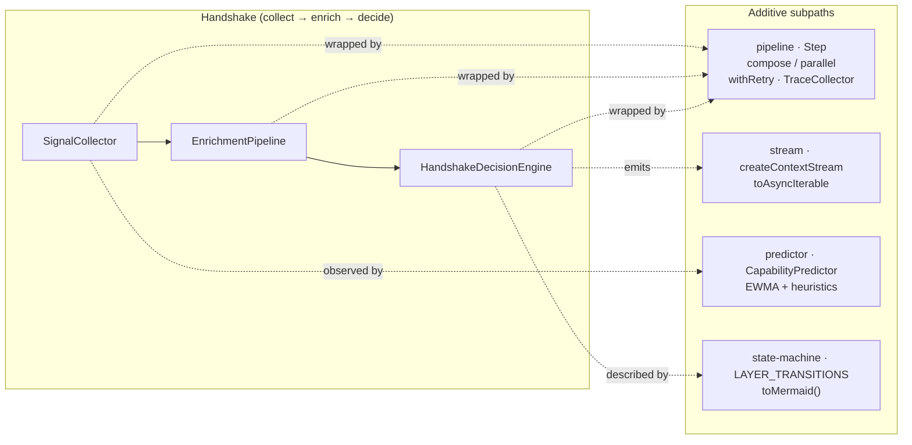
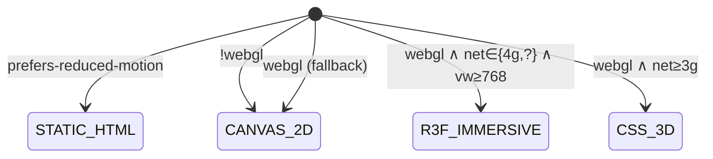

# Core concepts

Alphabet is built around four small ideas. This document describes each one
in enough depth to read the source code, write integrations, and review
PRs against the SDK.

> **Naming.** Alphabet expands to **Alphabet**. The
> brand origin is **الفبا (Alefba)**, the Persian word for *alphabet* —
> the elementary letters from which any language is built. Alphabet treats
> *language*, *direction*, *device*, *network*, and *consent* as letters
> of an alphabet that the page assembles itself from at runtime.

---

## 1. Context Handshake

The Context Handshake is a **pure, pipelined transformation** from
passive browser signals to a UI configuration. It is implemented in
`@alphabet/core/handshake` and runs entirely on the client (or on the edge,
if you prefer to do it server-side at request time — the code is
dependency-free and edge-safe).

```
SignalCollector ──▶ EnrichmentPipeline ──▶ HandshakeDecisionEngine
   (passive          (coarse geo,             (locale, dir, theme,
    browser           RTL detection,            capability layer,
    signals)          capability inference)     hero copy, privacyMode)
```

The same pipeline expressed as a `mermaid` flow with the additive
`pipeline / stream / predictor / state-machine` subpaths shipped
alongside it:



### Phases (lifecycle)

The full lifecycle is a six-phase state machine
(`HandshakeState` in `@alphabet/core/types`):

1. `detect` — `SignalCollector.collect()` reads passive signals.
2. `enrich` — `EnrichmentPipeline.enrich(signals, geoSeed)` derives
   `EnrichedContext` (coarse geo, RTL flag, capability hints).
3. `decide` — `HandshakeDecisionEngine.decide(enriched)` returns a
   `HandshakeDecision` containing `uiConfig` and `privacyMode`.
4. `display` — render the chosen layer (currently driven by
   `@alphabet/ui`'s `AdaptiveSlot`).
5. `consent` — present a consent banner if required by jurisdiction or
   policy version. Implemented as the `ConsentBanner` component in
   `@alphabet/ui` and the `ConsentTierManager` state machine in
   `@alphabet/security`.
6. `morph` — re-render with elevated permissions if the visitor grants
   or upgrades consent.

Phases 1–3 are shipped today as pure code with full unit-test coverage.
Phases 4–6 ship as React surface in `@alphabet/ui`; an end-to-end
`HandshakeOrchestrator` that drives the whole lifecycle in one call is
on the roadmap (see `docs/ROADMAP.md`, Phase 2).

### Inputs (passive only)

`SignalCollector` reads only what the browser already exposes:

- `navigator.language` and `navigator.languages`
- `Intl.DateTimeFormat().resolvedOptions().timeZone`
- `navigator.connection` (Network Information API)
- `navigator.doNotTrack`, `navigator.globalPrivacyControl`
- `window.innerWidth`, `window.innerHeight`, `devicePixelRatio`
- WebGL-context probe (capability hint, no fingerprinting)
- `matchMedia('(prefers-reduced-motion: reduce)')`,
  `matchMedia('(prefers-contrast: more)')`,
  `matchMedia('(prefers-color-scheme: dark)')`

Things Alphabet does **not** read: cookies, IndexedDB, localStorage, third-party
iframes, IP address, canvas/WebGL fingerprints, font enumeration, audio
context probes.

### Output

```ts
interface HandshakeDecision {
  uiConfig: {
    locale: string;            // BCP-47, e.g. 'en-US' / 'fa-IR'
    dir: 'ltr' | 'rtl';
    theme: 'light' | 'dark';
    layer: CapabilityLayer;    // R3F_IMMERSIVE | CSS_3D | CANVAS_2D | STATIC_HTML | TEXT_ONLY
    heroCopy: string;          // pre-localized copy for the hero region
  };
  privacyMode: PrivacyMode;    // see §2
  reasons: string[];           // human-readable trace, e.g. for TransparencyNotice
}
```

---

## 2. Consent ladder

Alphabet defines **four monotonic consent tiers**, ordered by what each one
permits:

| Tier         | Memory | Personalization | Analytics (k-anon) | Precise geo |
|--------------|:------:|:---------------:|:------------------:|:-----------:|
| `NO_MEMORY`  |   ❌   |        ❌       |         ❌         |      ❌     |
| `ANONYMOUS`  |   ✅   |        ❌       |         ✅         |      ❌     |
| `CONSENTED`  |   ✅   |        ✅       |         ✅         |      ❌     |
| `ENRICHED`   |   ✅   |        ✅       |         ✅         |      ✅     |

Two rules make this a *ladder*, not a free-form set of flags:

1. **Monotonic upgrades only.** A visitor can move up
   (`NO_MEMORY → ANONYMOUS → CONSENTED → ENRICHED`) but never silently
   downgrade. Downgrades are explicit (`revoke`, `reset`, or
   `downgradeOnPrivacySignal`) and always emit an audit event.
2. **DNT/GPC always wins.** If `navigator.doNotTrack === '1'` or
   `navigator.globalPrivacyControl === true`, Alphabet forces the *runtime*
   privacy mode to Tier 0 even if the visitor previously granted a
   higher tier. The stored consent record is preserved; only the
   effective permissions are downgraded.

The state machine lives in `@alphabet/security/ConsentTierManager` and the
permission helpers in `@alphabet/core/privacy`:

```ts
import { canStoreMemory, canPersonalize, canUseAnalytics, canUsePreciseGeo } from '@alphabet/core';

if (canStoreMemory(tier, signals)) {
  // safe to write to VisitorMemory
}
```

These four pure helpers are the **only authoritative permission checks**
in the SDK. Anything that bypasses them is a bug.

See [`docs/PRIVACY_MODEL.md`](./PRIVACY_MODEL.md) for the full model.

---

## 3. Adaptive Render Layers

Alphabet renders one of **five fidelity layers**, chosen from real device
capability and accessibility preferences:

| Layer          | Renderer                       | Picked when… |
|----------------|--------------------------------|--------------|
| `R3F_IMMERSIVE`| React Three Fiber + WebGL 2.0  | capable GPU, fast network, no `prefers-reduced-motion`. |
| `CSS_3D`       | CSS 3D transforms              | medium-tier device or fast network without WebGL2. |
| `CANVAS_2D`    | HTML5 Canvas 2D                | low-power devices or 2g/slow-2g networks. |
| `STATIC_HTML`  | Semantic HTML + CSS Grid       | SSR fallback, no JS, or `prefers-reduced-motion`. |
| `TEXT_ONLY`    | ARIA landmarks + plain text    | screen readers, very low bandwidth, or explicit minimum. |

Three rules make this trustworthy:

1. **Capability and accessibility drive the choice — not privacy.** A
   visitor with GPC enabled and a capable device still sees the
   immersive layer; they just don't get tracked.
2. **The base bundle is R3F-free.** The immersive layer is loaded
   lazily by `AdaptiveSlot` from `@alphabet/ui/layers/r3f` only when
   selected. There is a CI check (`pnpm size:check-r3f-free`) that
   asserts the base bundle does not transitively import
   `@react-three/fiber` or `three`.
3. **Layer is a *first-class* enum, not a guess.** It is part of the
   `HandshakeDecision` and is available to every downstream consumer
   (your own components, your A/B tests, your AI prompts, etc.).

See [`docs/ADAPTIVE_RENDER_LAYERS.md`](./ADAPTIVE_RENDER_LAYERS.md) for
the full capability matrix and accessibility rules.

> Earlier drafts of the project called this concept "UI Degradation".
> The new public name is **Adaptive Render Layers**. The TypeScript
> enum values (`R3F_IMMERSIVE`, `CSS_3D`, `CANVAS_2D`, `STATIC_HTML`,
> `TEXT_ONLY`) are unchanged.

### Layer-selection state machine

The decision rules are exposed as a **typed transition table** (data, not
XState) under `@alphabet/core/handshake/state-machine`. This gives us
TypeScript exhaustiveness via `assertNever`, parity-tested behavior
against `SignalCollector.detectLayer`, and a Mermaid renderer used to
keep this diagram and the runtime in lock-step:



The diagram is generated by `stateMachine.toMermaid()` — if the rule
table changes, the diagram changes with it (and the snapshot tests in
`decision-machine.test.ts` will fail until both are updated).

---

## 3a. Pipeline primitives, streaming, and prediction

The handshake also ships three additive subpaths that **wrap, never
replace**, the core `SignalCollector` / `EnrichmentPipeline` /
`HandshakeDecisionEngine` trio. They give consumers (and internal code)
cancellation, retries, tracing, and live capability prediction without
adding any runtime dependency.

### `@alphabet/core` `pipeline` — `Step<I, O>`

A small composable effect type:

```ts
import { pipeline } from '@alphabet/core';
const { defineStep, compose, parallel, withRetry, TraceCollector, makeStepContext } = pipeline;

const fetchSignals = defineStep('fetchSignals', async (_input, _ctx) => ok(signals));
const enrich       = defineStep('enrich', async (s, _ctx) => ok(enrichmentPipeline.enrich(s)));
const decide       = defineStep('decide', async (e, _ctx) => ok(engine.decide(e)));

const tracer = new TraceCollector();
const ac = new AbortController();
const result = await compose(compose(fetchSignals, enrich), decide).run(
  undefined,
  makeStepContext({ tracer, signal: ac.signal }),
);
console.log(tracer.snapshot()?.root); // nested span tree, durations, outcomes
```

- **Cancellation.** Every `Step` checks `ctx.signal` before running and
  is propagated to children of `parallel(…)` via an inner
  `AbortController` so a single sibling failure cancels the rest.
- **Retries.** `withRetry(fn, { maxAttempts, baseDelayMs, maxDelayMs })`
  uses **decorrelated jitter** (`next = min(cap, rand(base, prev*3))`)
  to avoid thundering-herd retries.
- **Tracing.** `TraceCollector` records nested spans with `durationMs`
  and `outcome ∈ {ok, error, cancelled}`. Spans only carry caller-supplied
  PII-free attributes.

### `@alphabet/core` `stream` — `createContextStream`

A live, PII-free stream of context events on the platform
`ReadableStream` API — no RxJS:

```ts
import { stream } from '@alphabet/core';
const { createContextStream, toAsyncIterable } = stream;

const { stream: rs, controller } = createContextStream({ highWaterMark: 16 });
controller.pushOutcome(handshakeResult.data);

for await (const event of toAsyncIterable(rs)) {
  // event ∈ { 'phase:start' | 'phase:end' | 'decision' | 'signal-update' | 'error' }
}
```

`createContextStream` honors an external `AbortSignal`, applies native
back-pressure via `highWaterMark`, and never emits raw `EnrichedContext`
— only the layer/locale/direction/`restricted` flag the UI actually
needs.

### `@alphabet/core` `predictor` — `CapabilityPredictor`

A heuristic + EWMA predictor for "what's the next likely layer?":

```ts
import { predictor } from '@alphabet/core';
const p = new predictor.CapabilityPredictor();
p.observe({ at: Date.now(), currentLayer: 'R3F_IMMERSIVE', networkType: '4g', batteryLevel: 0.7 });
p.observe({ at: Date.now(), currentLayer: 'R3F_IMMERSIVE', networkType: '3g', batteryLevel: 0.6 });
const prediction = p.predict();
// {
//   predictedLayer: 'CSS_3D',
//   confidence: 0.125,
//   warnings: [{ kind: 'network-downgrade', from: '4g', to: '3g' }]
// }
```

The predictor surfaces five PII-free warning kinds — `network-downgrade`,
`battery-low`, `battery-draining`, `reduced-motion-likely`, and
`tab-backgrounded` — over a bounded rolling window. **No ML runtime, no
model weights, no fetch calls.**

### Benchmarks

A `vitest bench` suite under `packages/core/src/handshake/*.bench.ts`
measures the pure-CPU portion of the pipeline. Run with
`pnpm -F @alphabet/core bench`. Indicative numbers on CI hardware:

| Stage                                | Mean    | Throughput |
|--------------------------------------|---------|------------|
| `SignalCollector.detectLayer`        | 0.07 µs | 14 M/s     |
| `HandshakeDecisionEngine.decide`     | 1.2 µs  | 0.8 M/s    |
| `EnrichmentPipeline.enrich`          | 4.4 µs  | 0.23 M/s   |
| `HandshakeOrchestrator.run` (end-to-end) | 5.6 µs  | 0.18 M/s   |
| `compose` 3-stage pipe (noop tracer) | 1.0 µs  | 1.0 M/s    |
| `compose` 3-stage pipe (TraceCollector) | 2.6 µs | 0.39 M/s |

These are throughput benches, not the wall-clock <100 ms budget — that
is dominated by browser-side I/O which we don't model here.

---

## 4. AI-ready, provider-neutral protocols

Alphabet treats LLMs as *one* possible consumer of the visitor context, not
as the centre of the SDK. The protocol layer
(`@alphabet/protocols`) defines a single normalized contract and exposes it
over multiple transports.

```
┌─────────────────────────────────────────────┐
│  AlphabetProtocolRequest / AlphabetProtocolResponse │
│            (the normalized contract)        │
└─────────────────────────────────────────────┘
        ▲          ▲          ▲           ▲
        │          │          │           │
   direct-api    mcp        a2a       qr-handoff
   (REST)    (Anthropic   (Google     (cross-device,
              MCP)        A2A)        AES-GCM-encrypted)
```

Three rules make this provider-neutral:

1. **No model client in the runtime.** `@alphabet/protocols` does not import
   OpenAI, Anthropic, or Vercel AI SDK. Provider integrations are
   exposed as the optional `AlphabetAiProviderAdapter` contract that
   consumers implement themselves.
2. **Consent is enforced at the boundary.** Every adapter calls
   `validateConsentScope` and `evaluateMemoryPermission` (the canonical
   implementations of the Alphabet consent ladder) before exposing memory
   or personalization to a model.
3. **QR handoff is encrypted by default.** Payloads are AES-GCM
   encrypted, audience-bound, expire in 60 seconds by default, and are
   PII-scrubbed before encoding.

See [`docs/PROTOCOLS.md`](./PROTOCOLS.md) and
[`docs/API_CONTRACT.md`](./API_CONTRACT.md).

---

## How the four concepts compose

```
    passive signals
          │
          ▼
   ┌──────────────┐
   │   Handshake  │ ──── decides ────▶  Adaptive Render Layer
   └──────────────┘
          │
          │ produces privacyMode
          ▼
   ┌──────────────┐
   │   Consent    │ ──── enforces ───▶  what is stored / personalized
   │    ladder    │
   └──────────────┘
          │
          │ produces a normalized request envelope
          ▼
   ┌──────────────┐
   │   Protocol   │ ──── exposes ────▶  Direct REST / MCP / A2A / QR
   │   adapters   │
   └──────────────┘
```

A useful one-liner: **Alphabet turns "what does this browser tell me?"
into a typed UI configuration, a typed consent posture, and a typed
protocol envelope — and then gets out of your way.**
